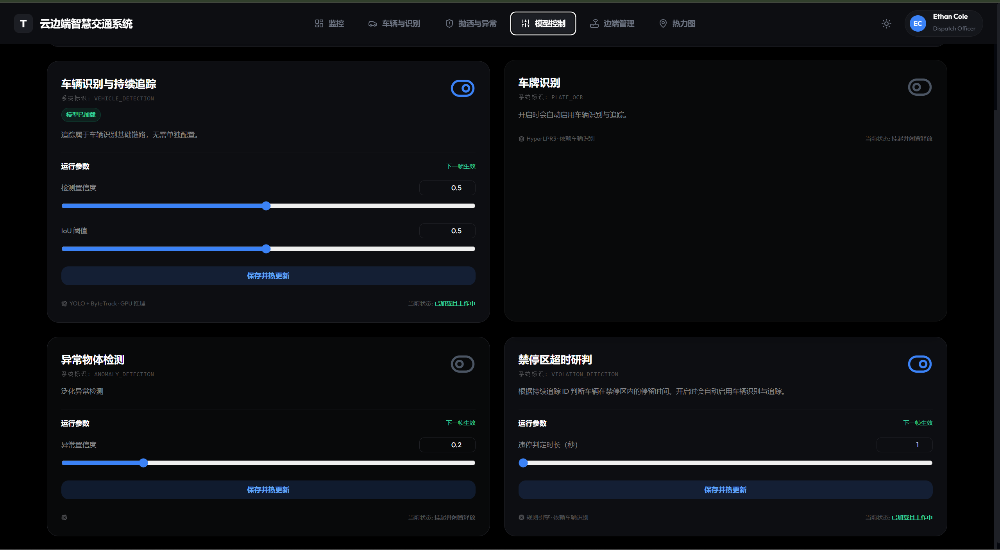
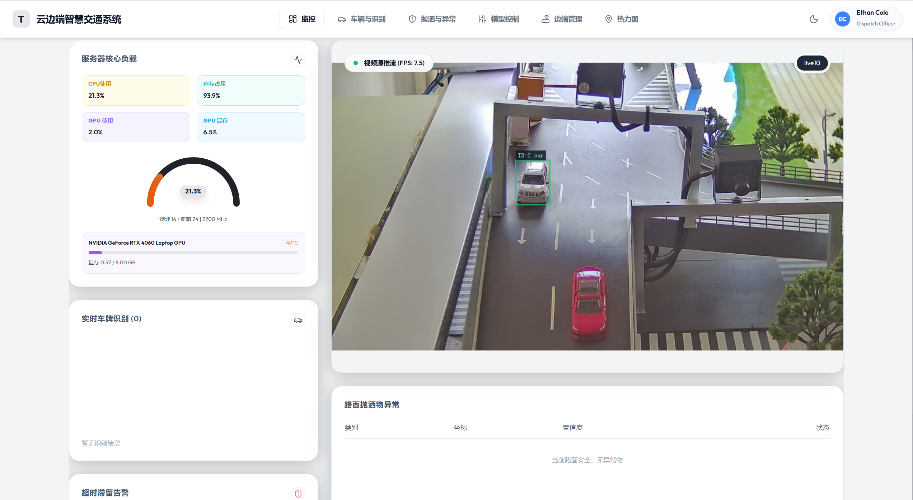
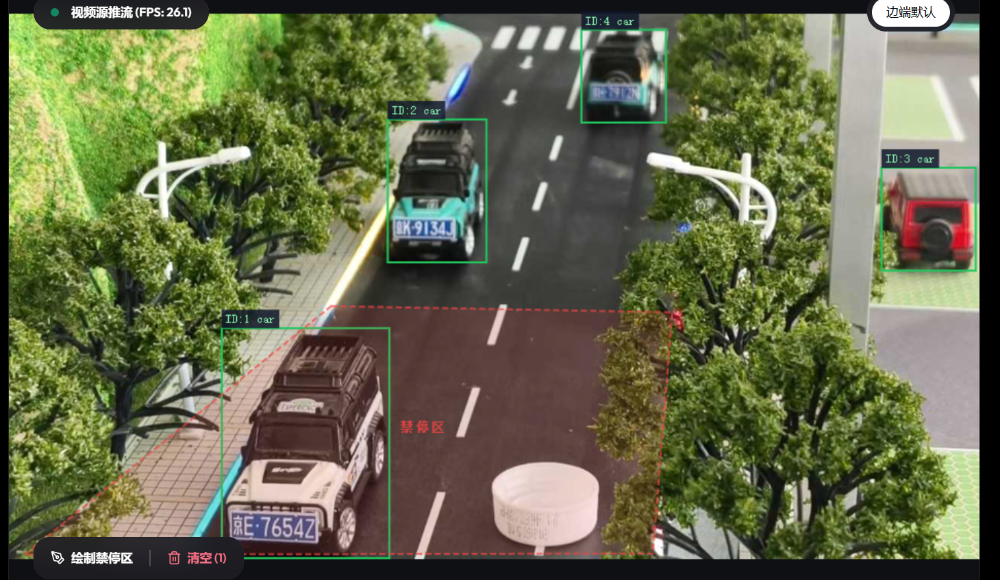
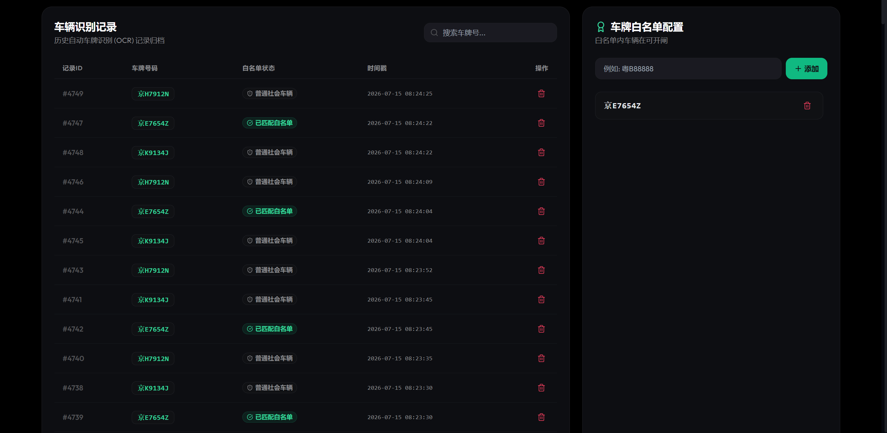
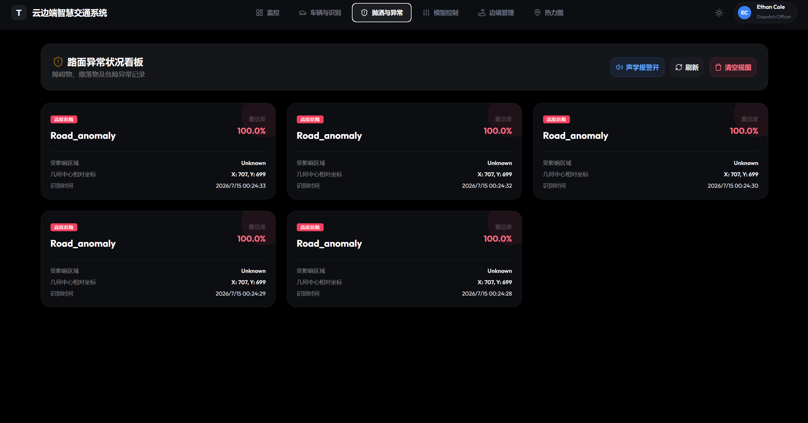
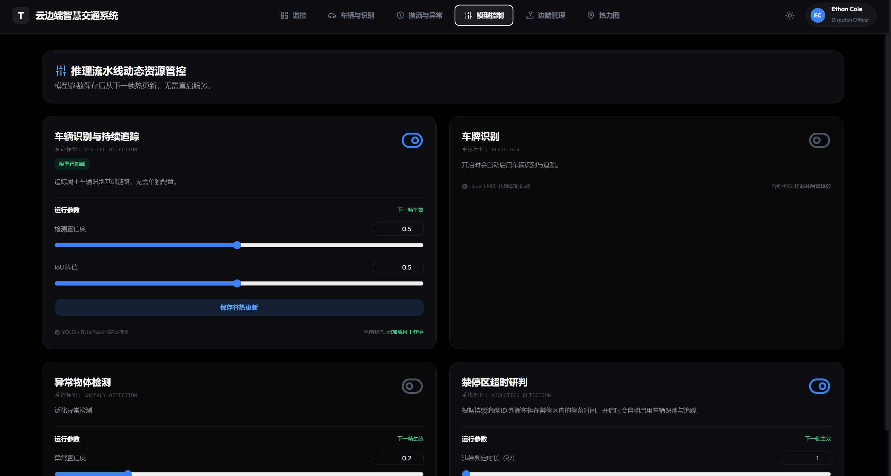
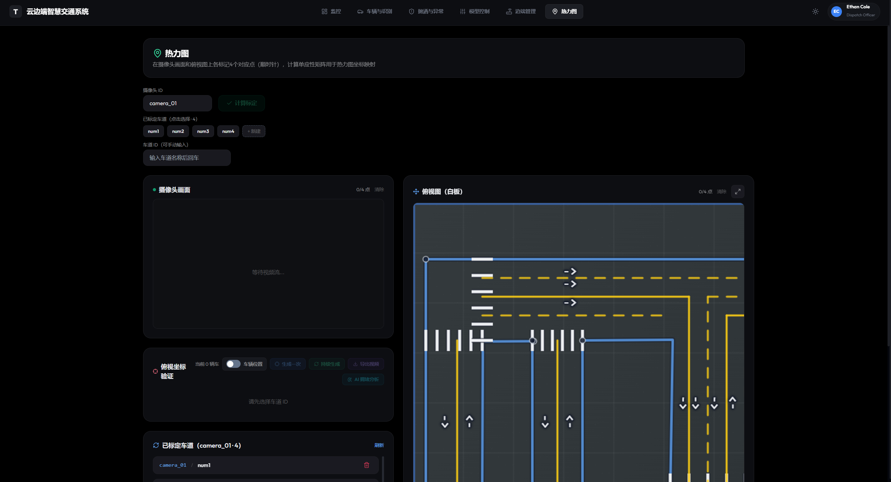
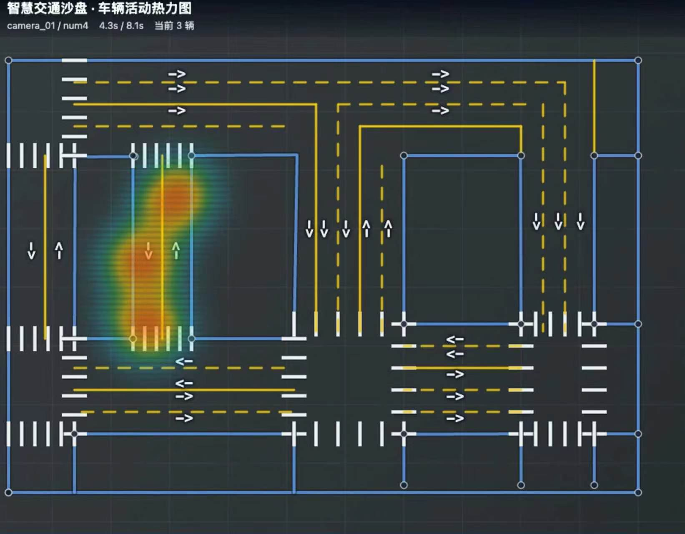

# 云边端智慧交通系统 — 软件使用说明书
---

## 目录

1. [系统简介](#1-系统简介)
2. [运行环境要求](#2-运行环境要求)
3. [安装与初始化](#3-安装与初始化)
4. [操作指南](#4-操作指南)
   - 4.1 [系统总览 —— 仪表盘主页](#41-仪表盘主页)
   - 4.2 [车辆识别与白名单管理](#42-车辆识别与白名单管理)
   - 4.3 [路面异常告警看板](#43-路面异常告警看板)
   - 4.4 [AI 推理流水线配置](#44-ai-推理流水线配置)
   - 4.5 [热力图标定与交通密度可视化](#45-热力图标定与交通密度可视化)
5. [附录：截图清单](#附录截图清单)

---

## 1. 系统简介

### 1.1 系统定位

**云边端智慧交通系统**是一套面向交通监控场景的视频流实时 AI 分析平台。

系统核心工作流程如下：

- 将监控摄像头视频流接入平台
- AI 引擎实时分析画面，自动检测车辆数量、识别车牌号码
- 自动识别路面抛洒物、障碍物等异常情况
- 自动判定禁停区域内是否存在超时滞留车辆
- 所有分析结果与实时画面集中展示于统一驾驶舱界面

### 1.2 主要功能概览

| 功能模块 | 能解决什么问题 | 简要说明 |
|----------|---------------|----------|
| **实时视频监控** | 多路摄像头画面统一查看 | 支持手机浏览器推流与 RTSP 沙盘摄像头拉流，画布实时渲染 |
| **车辆检测与跟踪** | 数清画面里有多少辆车、每辆车在哪 | 深度学习模型实时检测，自动给每辆车分配唯一跟踪 ID |
| **车牌自动识别** | 自动读取车牌号 | 支持中国蓝牌与绿牌（新能源），识别结果可写入白名单 |
| **路面异常检测** | 发现路上的障碍物、抛洒物 | 双路背景建模算法，不依赖预定义类别，任何不该在路面上的物体都能检测 |
| **违停超时研判** | 自动判断禁停区内的违规停车 | 用户绘制禁停区域，系统按停留时长自动判定是否违停 |
| **交通密度热力图** | 直观展示哪段路最拥堵 | 车辆轨迹密度热力图，按绿→黄→橙→红渐变渲染 |
| **AI 能力热插拔** | 按需开关 AI 功能，节省计算资源 | 未使用的检测能力可一键关闭，自动释放 GPU 显存 |
| **系统资源监控** | 实时了解服务器运行状况 | CPU/内存/GPU/显存/网络速率实时展示 |

### 1.3 系统适用场景

- **交通监控中心**：集中管理多个路口的监控摄像头，实时告警路面异常
- **智慧停车场**：车牌白名单自动开闸、违停区域监控
- **智慧高速**：路面抛洒物实时检测、交通拥堵热力图分析
- **教学/科研演示**：一站式展示云边端 AI 流水线推理全过程

---

## 2. 运行环境要求

### 2.1 硬件要求

#### 服务器端（运行 AI 推理）

| 项目 | 最低要求 | 推荐配置 |
|------|---------|---------|
| **GPU** | NVIDIA 显卡，显存 ≥ 4GB（支持 CUDA 11.8+） | 显存 ≥ 8GB（用于 12 路摄像头并发推理） |
| **CPU** | 4 核心 | 8 核心以上 |
| **内存** | 8 GB | 16 GB 以上 |
| **磁盘** | 10 GB 可用空间 | SSD 20 GB+ |
| **网络** | 局域网 100 Mbps | 千兆以太网 |

> **注意**：若不使用 GPU（纯 CPU 推理），YOLO 检测速度会下降约 5-10 倍，仅适合单路低帧率场景。

#### 边缘端（推流设备）

| 项目 | 要求 |
|------|------|
| **设备类型** | 智能手机（Android/iOS）或带有摄像头的 PC |
| **浏览器** | Chrome 90+ / Safari 14+ / Edge 90+（需支持 WebRTC getUserMedia） |
| **网络** | 与服务器在同一局域网，延迟 < 50ms 最佳 |

#### 客户端（查看驾驶舱）

| 项目 | 要求 |
|------|------|
| **设备类型** | 任意桌面 PC 或平板 |
| **浏览器** | Chrome 90+ / Edge 90+ / Firefox 100+ |
| **屏幕分辨率** | ≥ 1366×768（推荐 1920×1080） |

### 2.2 软件要求

#### 服务器端

| 软件 | 版本要求 | 说明 |
|------|----------|------|
| **Python** | 3.9 ~ 3.11 | 推荐 3.10 或 3.11（ultralytics 兼容性最佳） |
| **pip** | 22.0+ | Python 包管理器 |
| **CUDA** | 11.8 或 12.1 | GPU 推理必需（CPU 模式可跳过） |
| **NVIDIA 驱动** | 525.0+ | GPU 推理必需，`nvidia-smi` 可正常执行 |
| **ffmpeg** | 4.0+ | RTSP 拉流必需（不接 RTSP 可跳过） |
| **openssl** | 1.1+ | SSL 证书生成（仅 `enable_ssl: true` 时需要） |

#### 客户端

| 软件 | 版本要求 | 说明 |
|------|----------|------|
| **Node.js** | 18 LTS+ | 前端开发服务器（仅开发调试时需要；生产环境仅需浏览器） |
| **npm** | 9.0+ | 随 Node.js 安装 |

#### 边端推流设备

- 现代浏览器即可，无需安装任何软件

---

## 3. 安装与初始化

### 3.1 步骤一：安装系统依赖

#### 3.1.1 安装 Python

从 [python.org](https://www.python.org/downloads/) 下载 Python 3.10 或 3.11，安装时勾选 **"Add Python to PATH"**。

安装完成后，打开终端验证：

```bash
python --version
# 应输出: Python 3.10.x 或 Python 3.11.x
```

#### 3.1.2 安装 ffmpeg（RTSP 拉流必需）

| 操作系统 | 安装方式 |
|----------|----------|
| **Windows** | `winget install ffmpeg` 或从 [ffmpeg.org](https://ffmpeg.org/download.html) 下载，将 `bin/` 加入系统 PATH |
| **macOS** | `brew install ffmpeg` |
| **Linux** | `sudo apt install ffmpeg` |

验证安装：

```bash
ffmpeg -version
# 应输出 ffmpeg 版本信息
```

#### 3.1.3 安装 Node.js（前端开发调试需要）

从 [nodejs.org](https://nodejs.org/) 下载 LTS 版本安装。

验证安装：

```bash
node --version   # 应输出 v18.x.x 或更高
npm --version    # 应输出 9.x.x 或更高
```

### 3.2 步骤二：安装 Python 依赖包

```bash
# 1. 进入项目目录
cd smart

# 2. 创建虚拟环境（强烈推荐）
python -m venv venv

# 3. 激活虚拟环境
# Windows:
venv\Scripts\activate
# macOS / Linux:
source venv/bin/activate

# 4. 安装基础依赖
pip install -r requirements.txt

# 5. 安装 PyTorch GPU 版本（根据 CUDA 版本选择其一）
# CUDA 11.8:
pip install torch torchvision --index-url https://download.pytorch.org/whl/cu118
# CUDA 12.1:
pip install torch torchvision --index-url https://download.pytorch.org/whl/cu121
```

### 3.3 步骤三：配置 GPU 环境

安装完依赖后，运行 GPU 配置脚本（仅需执行一次）：

```bash
python scripts/setup_gpu.py
```

该脚本会自动完成：
- 修补 HyperLPR3 的 ONNX Runtime 推理提供者，切换为 GPU 加速
- 将 PyTorch CUDA DLL 链接到 ONNX Runtime 目录
- 运行推理验证，确认 GPU 已成功加载

> **如果使用纯 CPU 推理**（无 NVIDIA 显卡）：跳过此步骤，并确保安装的 PyTorch 为 CPU 版本（`pip install torch torchvision` 不加 `--index-url`）。

#### 验证 GPU 是否正常工作

```bash
python test-model-load/test_gpu.py
```

期望输出类似：

```
PyTorch: 2.x.x
CUDA available: True
CUDA device: NVIDIA GeForce RTX xxxx
YOLO model loaded successfully.
HyperLPR3 model loaded successfully.
```

如果 `CUDA available: False`，请检查：
1. PyTorch 是否安装了 `cu118`/`cu121` 版本（而非 `cpu` 版本）
2. NVIDIA 驱动是否正常（`nvidia-smi` 可执行）
3. `scripts/setup_gpu.py` 是否已执行

### 3.4 步骤四：修改配置文件

编辑项目根目录下的 `config.yaml`，以下参数**必须**根据实际环境修改：

```yaml
# === 必改参数 ===

# 服务器对外 IP 地址（手机推流时需要）
server_ip: 100.117.93.85   # ← 改为你的服务器 IP

# SSL 开关（无 openssl 环境需改为 false）
cloud_server:
  enable_ssl: true         # ← 无法生成证书时改为 false

  models:
    # 车辆检测模型路径（确认文件存在）
    yolo_model_path: models\yolov11s_cisdrone_t.pt   # ← 检查路径

    # 异常检测模型路径（确认文件存在）
    anomaly_model_path: models/yolo26s.pt            # ← 检查路径
```

常用可选调整参数：

| 参数路径 | 默认值 | 说明 |
|----------|--------|------|
| `cloud_server.port` | `8000` | 云端服务端口 |
| `cloud_server.video.fps` | `15` | 视频处理帧率 |
| `cloud_server.models.yolo_confidence` | `0.5` | 车辆检测灵敏度（越高误检越少，漏检越多） |
| `cloud_server.thresholds.parking_duration_limit` | `1.0` | 违停判定时间（秒） |

完整参数说明请参考 [系统设计方案.md](./系统设计方案.md) 第 6 章。

### 3.5 步骤五：启动云端主服务

```bash
# 确保虚拟环境已激活
# Windows:
py -m cloud_server.main
# macOS / Linux:
python -m cloud_server.main
```

启动成功的标志：
```
[INFO] PyTorch: 2.x.x
[INFO] CUDA available: True
[INFO] Database tables initialized successfully.
[INFO] Pipeline nodes registered: [...6个节点名...]
[INFO] RTSP stream manager initialized.
[INFO] Application startup complete.
```

服务启动后，可以通过浏览器访问 `http://<服务器IP>:8000/docs` 查看自动生成的 API 文档（Swagger UI）。

### 3.6 步骤六：连接视频源

系统支持两种视频源接入方式。

#### 方式 A：手机/浏览器推流

1. 在手机或电脑浏览器中打开推流页面：
   ```
   http://<服务器IP>:8000/phone
   ```
2. 选择 **摄像头模式**（授权摄像头权限）或 **本地视频模式**（选取文件）
3. 输入设备 ID（如 `camera_01`）和服务器地址
4. 点击 **"开始推流"**

#### 方式 B：RTSP 沙盘摄像头拉流

通过驾驶舱前端的仪表盘页面，可以批量启动沙盘摄像头。具体操作见 [4.1.3 管理沙盘摄像头](#管理沙盘摄像头)。

### 3.7 步骤七：启动前端驾驶舱（可选）

```bash
cd frontend

# 安装前端依赖（仅首次）
npm install

# 启动开发服务器
npm run dev
```

启动后访问 `http://localhost:5173` 即可进入驾驶舱。

### 3.8 步骤八：验证系统正常工作

1. 确认视频源已连接 → 仪表盘页面应出现实时画面
2. 画面上应出现**车辆检测框**（绿色矩形 + 车辆 ID）
3. 左侧面板应显示系统资源指标（CPU/GPU/内存等）
4. 若有车辆进入禁停区，右侧应出现**违停告警**
5. 若有路面异常物，右侧表格应出现**异常记录**

---

## 4. 操作指南

本系统的驾驶舱前端包含 **5 个功能页面**，通过顶部导航栏切换：

```
[监控] [车辆与识别] [抛洒与异常] [大模型引擎] [热力图]
```

---

### 4.1 仪表盘主页

**导航**：顶部导航栏 → **"监控"**（默认首页）

仪表盘是系统的核心操作页面，集成了实时视频监控、AI 分析结果可视化、禁停区管理、系统资源监控等功能。

#### 页面布局

页面采用**左右双栏**布局：

| 区域 | 位置 | 内容 |
|------|------|------|
| 服务器负载监控 | 左上 | CPU/内存/GPU/显存使用率弧形进度条 |
| 实时车牌识别 | 左下 | 近期识别到的车牌号码卡片列表 |
| 超时滞留告警 | 左下 | 违停车辆 ID、区域名称、滞留时长 |
| 视频流监控区 | 右侧主区域 | 画布实时渲染视频帧 + AI 标注叠加 |
| 路面异常表格 | 右侧底部 | 异常物类型、坐标、置信度 |



#### 4.1.1 查看实时视频与 AI 标注

视频画面上会实时叠加 AI 推理结果：

| 标注类型 | 颜色 | 显示内容 |
|----------|------|----------|
| 车辆检测框 | 绿色矩形 | 跟踪 ID + 类型 (car) + 车牌号 |
| 路面异常检测框 | 红色矩形（高置信度）/ 橙色矩形（低置信度） | 异常类型标签 + 置信度百分比 |
| 禁停区边界 | 红色半透明多边形 | 区域名称 |



#### 4.1.2 切换视频源

视频画面上方有一排**圆角切换按钮**，分为两类：

- **"边端默认"**：来自手机/浏览器推流的视频（`/ws/stream/{device_id}`）
- **沙盘摄像头**（如"桥面"、"道路1"等）：来自 RTSP 沙盘摄像头拉流

点击任一按钮即可切换到对应的摄像头画面。当前选中的按钮显示为高亮蓝色边框。

> **注意**：沙盘摄像头需要先在 [4.1.3 节](#管理沙盘摄像头) 中启动 RTSP 拉流后才会显示视频画面。

#### 4.1.3 管理沙盘摄像头

在视频画面下方有一个 **"沙盘摄像头管理"** 卡片，提供以下操作：

| 按钮 | 功能 |
|------|------|
| **"启动全部沙盘"** | 一键开启全部 12 路 RTSP 摄像头拉流 |
| **"停止全部沙盘"** | 停止所有 RTSP 拉流，释放系统资源 |
| **各摄像头独立启停按钮** | 单独控制每一路摄像头的开关 |

#### 4.1.4 查看系统资源负载

左侧面板顶部展示实时系统指标：

| 指标 | 展示方式 | 说明 |
|------|----------|------|
| CPU 使用率 | 弧形进度条 + 百分比数值 | 服务器 CPU 负载 |
| 内存使用率 | 弧形进度条 + 已用/总量 GB | 服务器 RAM 使用情况 |
| GPU 使用率 | 弧形进度条 + 百分比 | GPU 核心利用率 |
| 显存使用率 | 进度条 + 已用/总量 GB | GPU 显存占用 |

在 GPU 卡片上可查看详细信息：型号、温度。

#### 4.1.5 绘制与管理禁停区

在视频画面上可以直接绘制**禁停区多边形**：

**操作步骤**：

1. 点击画布下方工具栏中的 **"绘制禁停区"** 按钮（变为蓝色高亮表示进入绘制模式）
2. 点击输入框输入区域名称（如"主路禁停区"）
3. 在视频画面上**依次点击**确定多边形的顶点（至少 3 个点）
4. 点击 **"保存"** 按钮保存禁停区配置
5. 保存后，系统会在下一帧开始对该区域内的车辆进行违停计时

| 按钮 | 功能 |
|------|------|
| **"绘制禁停区"** | 进入/退出绘制模式 |
| **"保存"** | 将当前绘制的多边形保存到后端 |
| **"取消"** | 退出绘制模式，不保存 |
| **"清空 (N)"** | 删除所有已定义的禁停区 |

> **提示**：禁停区使用归一化坐标（0 到 1），保存后适配不同分辨率的视频流。配置同时写入 `config.yaml` 文件，重启服务后仍然有效。



#### 4.1.6 查看违章告警

右侧面板的 **"超时滞留告警"** 区域实时展示当前检测到的违停事件：

| 字段 | 说明 |
|------|------|
| 车辆 ID | 违停车辆的跟踪 ID |
| 区域名称 | 进入的禁停区名称（如"主路禁停区"） |
| 滞留时长 | 车辆在该区域停留的秒数 |

告警在车辆离开禁停区后自动消失。

#### 4.1.7 查看路面异常检测结果

右侧底部的 **"路面抛洒物异常"** 表格列出当前画面中检测到的异常物体：

| 列名 | 说明 |
|------|------|
| 类别 | 异常类型标签 (road_anomaly) |
| 坐标 | 异常物在画面中的像素位置 |
| 置信度 | 检测置信度百分比 |
| 状态 | 是否已上报 |

---

### 4.2 车辆识别与白名单管理

**导航**：顶部导航栏 → **"车辆与识别"**

该页面用于查询历史车牌识别记录和管理车牌白名单配置。

#### 页面布局

| 区域 | 内容 |
|------|------|
| 左侧（2/3 宽度） | 车辆识别记录表格 + 搜索框 |
| 右侧（1/3 宽度） | 车牌白名单配置面板 |



#### 4.2.1 查询识别记录

左侧表格展示系统历史 OCR 识别到的车牌记录：

| 列名 | 说明 |
|------|------|
| 记录 ID | 数据库自增主键 |
| 车牌号码 | 识别到的车牌号（等宽字体绿色高亮显示） |
| 白名单状态 | 绿色标签"已匹配白名单" 或 灰色"普通社会车辆" |
| 时间戳 | 识别时间 |
| 操作 | 垃圾桶图标删除按钮 |

**搜索功能**：在表格上方的搜索框中输入车牌号的任意部分（如"粤B8"），表格会实时过滤显示匹配的记录。

**删除记录**：点击某行的垃圾桶图标，在弹出的确认对话框中点击"确认删除"。

> 页面每 10 秒自动刷新一次。

#### 4.2.2 管理白名单

右侧面板管理车牌白名单：

| 组件 | 说明 |
|------|------|
| 输入框 | placeholder 为"例如: 粤B88888"，支持中文 |
| **"添加"** 按钮 | 将输入的车牌号添加到白名单（自动转大写和格式校验） |
| 白名单列表 | 每项显示车牌号 + 垃圾桶移除按钮 |

**添加操作**：
1. 在输入框中输入车牌号（如 `粤B88888`）
2. 点击 **"添加"** 按钮
3. 系统会自动校验格式——不合法会提示"请输入有效的中国车牌号"

**移除操作**：在白名单列表中点击对应车牌的垃圾桶按钮即可移除。

> **注意**：白名单配置保存在服务器 `data/whitelist.json` 文件中，重启服务后仍然有效。

---

### 4.3 路面异常告警看板

**导航**：顶部导航栏 → **"抛洒与异常"**

该页面是路面异常的**独立监控看板**，以卡片网格形式展示历史告警记录，并支持声学报警。

#### 页面布局

| 区域 | 内容 |
|------|------|
| 顶部控制栏 | 标题、声学报警开关、刷新按钮、清空视图按钮 |
| 主体区域 | 异常卡片响应式网格（3 列） |



#### 4.3.1 控制栏操作

| 按钮 | 图标 | 功能 |
|------|------|------|
| **"声学报警开/关"** | 喇叭图标 | 开启后，当新异常出现时浏览器播放双频警报音 |
| **"刷新"** | 旋转刷新图标 | 手动从后端拉取最近 60 分钟的异常数据 |
| **"清空视图"** | 红色垃圾桶图标 | 清除当前页面展示的所有卡片（仅本地清除，不影响后端数据） |

页面每 5 秒自动刷新一次。若异常数量增加，会自动触发声学警报。

#### 4.3.2 异常卡片解读

每张异常卡片展示一个检测到的异常物：

| 卡片元素 | 说明 |
|----------|------|
| 左上角危险等级标签 | **"高度危险"**（红色，置信度 > 45%）或 **"轻度警告"**（黄色） |
| 异常类型 | 如 Road_anomaly、Obstacle、Debris 等 |
| 置信度百分比 | 大字体显示，颜色随等级变化 |
| 受影响区域 | 如"主干道 (Main Road)" |
| 几何中心坐标 | X, Y 像素坐标 |
| 识别时间 | 发现异常的时间 |
| 右上角装饰光晕 | 半透明圆形，颜色随危险等级变化 |

#### 4.3.3 空状态

当没有异常记录时，页面显示空状态提示：

> ✨ 目前没有路面异常或抛洒物告警  
> 系统正在持续监控路面，如发现障碍物、撒落物或危险物体将实时告警

---

### 4.4 AI 推理流水线配置

**导航**：顶部导航栏 → **"大模型引擎"**

该页面用于**动态管控 AI 推理能力**——可以随时启用/禁用各个 AI 节点，以及调整模型参数（热更新，无需重启服务）。

#### 页面布局

| 区域 | 内容 |
|------|------|
| 顶部说明卡片 | 使用说明文字 |
| 主体区域 | 4 张模型配置卡片（2 列网格） |



#### 4.4.1 四个推理能力节点

| 显示名称 | 系统标识 | 说明 |
|----------|----------|------|
| 车辆识别与持续追踪 | `vehicle_detection` | YOLO 检测 + ByteTrack 跟踪，最基础的能力 |
| 车牌识别 | `plate_ocr` | HyperLPR3 车牌识别，**依赖车辆识别** |
| 异常物体检测 | `anomaly_detection` | 双路背景建模路面异常检测 |
| 禁停区超时研判 | `violation_detection` | 违停规则引擎，**依赖车辆识别** |

#### 4.4.2 启用/禁用 AI 能力

每张模型卡片顶部有一个**大号开关图标**：

- **蓝色开关**（`ToggleRight`）：当前已启用
- **灰色开关**（`ToggleLeft`）：当前已禁用

点击开关即可切换状态。切换后：

- **启用**：后端自动加载模型到显存，下一帧开始生效
- **禁用**：后端自动卸载模型释放显存，画面上的相应标注消失

> **依赖提示**：关闭 `vehicle_detection` 时，系统会自动关闭所有依赖它的能力（车牌识别、违停研判）。

#### 4.4.3 调整模型参数（热更新）

每张卡片中的**参数区域**包含可调节的数值参数：

| 能力 | 可调参数 | 说明 | 范围 |
|------|----------|------|------|
| 车辆检测 | 检测置信度 | 越高误检越少，漏检越多 | 0.01 ~ 1.0 |
| 车辆检测 | IoU 阈值 | 重叠框去重的严格程度 | 0.01 ~ 1.0 |
| 异常检测 | 异常置信度 | 异常判定灵敏度 | 0.01 ~ 1.0 |
| 违停研判 | 违停判定时长 | 触发告警的停留时间（秒） | 0.1 ~ 3600 |

**操作步骤**：
1. 拖动滑块或直接在输入框中输入数值
2. 点击卡片的 **"保存并热更新"** 按钮
3. 按钮文字变为 **"下一帧生效"**，随后恢复原状
4. 参数从下一帧起生效，**无需重启服务**

#### 4.4.4 运行状态解读

每张卡片底部显示当前运行状态：

| 状态 | 含义 |
|------|------|
| **"已加载且工作中"** | 模型已加载到 GPU，正在接收推理请求 |
| **"挂起并闲置释放"** | 节点已禁用，显存已释放，零算力开销 |
| **"模型加载失败"**（红色） | 模型文件未找到或加载出错，需检查 `config.yaml` 路径 |

---

### 4.5 热力图标定与交通密度可视化

**导航**：顶部导航栏 → **"热力图"**

该页面是逆透视变换**标定工具**和**交通密度热力图**的结合体。通过标定可以将斜视角度的摄像头坐标映射到俯视道路平面，然后在俯视图上渲染车辆轨迹热力分布。

#### 页面布局

| 区域 | 内容 |
|------|------|
| 左侧控制区（~42%） | 摄像头画面、标定点选取、车道管理、转换验证、标定列表 |
| 右侧俯视白板（~58%） | 道路模型底图 + 世界坐标选点 + 热力图图层 |



#### 4.5.1 选择视频源与车道

**视频源切换**：左侧顶部按钮组，与仪表盘相同——可选择"边端默认"或沙盘摄像头。

**车道选择**：点击已有车道按钮或 **"新建车道"**（输入车道 ID 如 `northbound`）。

#### 4.5.2 标定流程（四点透视映射）

标定需要在两个画面上**各选 4 个对应点**：

| 画面 | 选点方式 | 规则 |
|------|----------|------|
| **摄像头画面**（左侧） | 点击画面上 4 个位置 | 必须按**顺时针**顺序：左上 → 右上 → 右下 → 左下 |
| **俯视白板**（右侧） | 点击俯视图上对应 4 个位置 | 同上，与摄像头画面点位一一对应 |

**操作步骤**：

1. 在摄像头画面上**点击 4 个点**——出现绿色圆点 + 序号 + 绿色虚线连线
2. 在俯视白板上**点击对应的 4 个点**——红色标记
3. 确认两侧点数均为 `4/4`
4. 点击 **"提交标定"** 按钮
5. 标定成功后，顶部出现绿色成功提示

**[此处插入截图：摄像头画面上的标定点（4 个绿色圆点 + 连线）]**
**[此处插入截图：俯视白板上的标定点 + 全貌视图]**

#### 4.5.3 坐标转换验证

标定完成后，可以使用以下按钮验证转换效果：

| 按钮 | 功能 |
|------|------|
| **"开始转换"** | 单次将当前帧中所有车辆坐标从摄像坐标转换为俯视坐标 |
| **"开始连续转换"** | 定时自动转换（每 5 秒），按钮变为红色"结束转换" |
| **"开始持续渲染热力图"** | 定时自动刷新热力图，按钮变为红色"结束渲染热力图" |

转换结果以表格形式展示：

| ID | 类型 | 摄像坐标 | 俯视坐标 |
|----|------|----------|----------|
| 1 | car | (320, 350) | (165.3, 210.7) |
| 2 | car | (600, 380) | (295.1, 215.2) |

#### 4.5.4 热力图渲染

点击 **"渲染一次热力图"** 或 **"开始持续渲染热力图"** 后，俯视白板上会出现车辆轨迹密度热力图层。

**热力图颜色含义**：

| 颜色 | 密度 | 含义 |
|------|------|------|
| 青色（#22D3EE） | 极低 | 零星车辆 |
| 绿色（#22C55E） | 较低 | 少量车辆 |
| 黄色（#FACC15） | 中等 | 轻度拥堵 |
| 橙色（#F97316） | 较高 | 中度拥堵 |
| 红色（#EF4444） | 最高 | 严重拥堵 |

热力图会随时间自动渐变淡化（衰减系数 0.94），实时反映最新的交通密度分布。



#### 4.5.5 管理标定配置

左侧底部 **"已标定车道"** 列表展示所有已有的标定记录：

| 显示内容 | 操作 |
|----------|------|
| `camera_01 / northbound` | 垃圾桶删除按钮 |
| `camera_01 / southbound` | 垃圾桶删除按钮 |

点击垃圾桶按钮可删除指定的标定配置。

#### 4.5.6 全屏查看俯视图

点击俯视白板上的 **"全屏"** 图标（`Maximize2`），可弹窗全屏查看俯视图，按 `X` 或 `ESC` 退出。

---